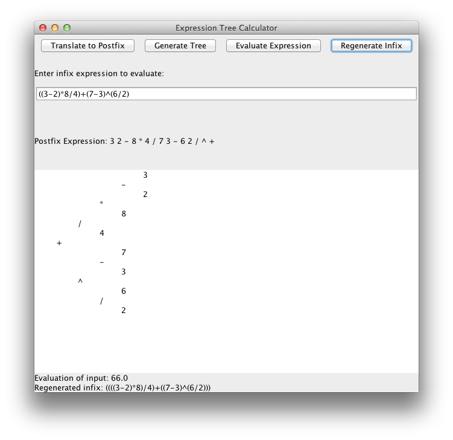

#Binomial Calculator
An efficient application designed to evaluate mathematical expressions using various data structures such as binary search trees and stacks.

##Description
Program acts as an Expression Tree Calculator by performing operations on a postfix string. It takes an infix expression from the user in a GUI and translates it to postfix. It then creates a tree and traverses the tree to determine the value of the user's expression. It finally regenerates the infix expression by traversing the tree recursively.

##Screenshot

##Running the Program
To compile the program, run line:
`javac *.java`

To run the program, run line (opens up a GUI):
`java Window`